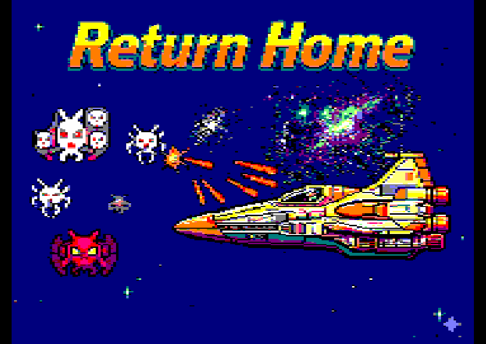
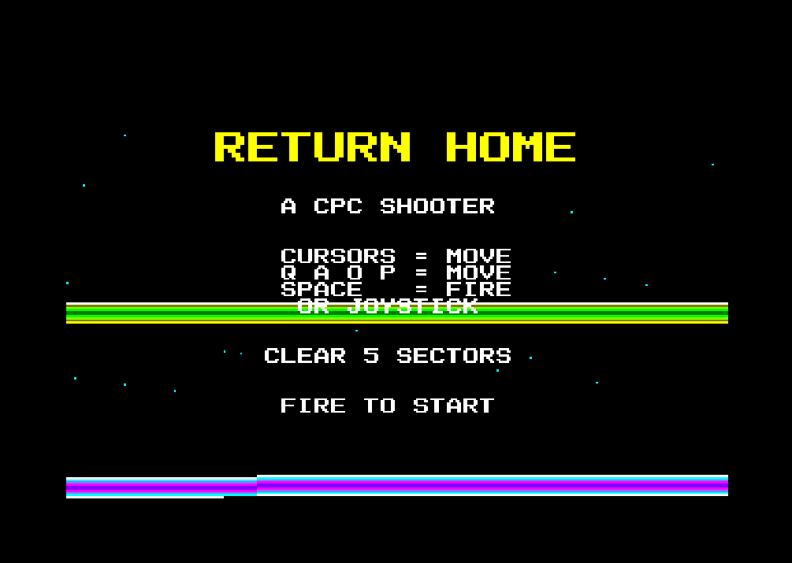
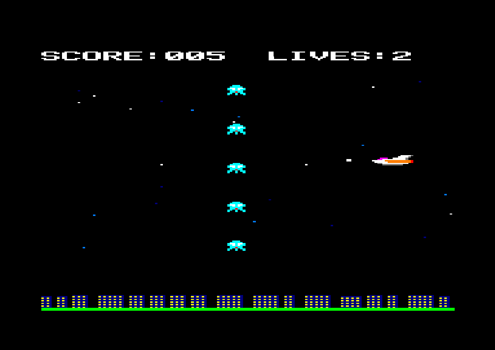

# Return Home

A space shooter for the **Amstrad CPC** (464 / 664 / 6128), written in hand-coded
Z80 assembly by Claude Code. Mode 0, 16 colours, hardware double-buffered, and completely
**firmware-less** — it takes over the machine on boot and talks straight to the
Gate Array, CRTC, PSG and keyboard.

You are heading home. Your ship sits on the **right**, facing left and firing
left; enemies pour in from the **left**; a three-layer parallax starfield drifts
behind a scrolling **cityscape** that slowly changes from a dense downtown into
quiet houses as you near home. Survive five sectors and you're home.

> Status: developed and tested with emulators (JavaCPC, plus a custom Z80
> emulator in `tools/z80test.py`). Not yet verified on original hardware.
---

 
 
 

---

## Play it

1. Open `dist/returnhome.dsk` in any Amstrad CPC emulator (JavaCPC, WinAPE,
   Caprice, RetroVirtualMachine, Arnold, …).
2. At the BASIC prompt type:

   ```
   RUN"DISC"
   ```

The loader shows the loading screen, then the title.

### Controls

| Action | Keys |
| ------ | ---- |
| Move up    | Cursor&nbsp;Up   / `Q` |
| Move down  | Cursor&nbsp;Down / `A` |
| Fire       | `Space` / Joystick fire |

(`O` / `P` also move; the game reads the keyboard matrix directly, so a joystick
works too.)

### Secret

Type **`TOPGUN`** on the title screen to toggle invincibility — the border turns
red when it's on.

---

## How the game plays

Progress is structured as a hierarchy:

```
pattern  = 5 enemies
wave     = 5 patterns      (25 enemies)
sector N = N waves
win      = clear 5 sectors (15 waves, 375 enemies total)
```

- **Sector 1** is one wave; **sector 5** is five waves. Enemy speed is constant
  *within* a sector and steps up *between* sectors, so it gets relentlessly
  faster the closer you get to home.
- Each wave cycles through **5 enemy types**, each with its own attack pattern and
  look: sine (white), diagonal (red), wall (cyan), big-sine (yellow) and snake
  (magenta).
- **Power-ups:** clear a full wave's worth of enemies in a row (a 5-kill streak)
  and your weapon upgrades — single shot → dual → three-way spread. Let an enemy
  escape off the right edge and the streak resets; take a hit and you drop back to
  a single shot.
- The **cityscape** under you evolves per sector: a tall, dense city in sector 1,
  shrinking and thinning out through the middle sectors, until it's just little
  houses in sector 5 — you've made it back to the suburbs.

---

## Build it

You need **Python 3.8+**. The assembler ([RASM](http://www.roudoudou.com/rasm/))
is bundled in `tools/` as a Windows binary.

```sh
python build.py
```

That assembles `src/return_home.asm` and writes a bootable
`dist/returnhome.dsk`. On Linux/macOS, install RASM and point the build at it:

```sh
RASM=/path/to/rasm python build.py
```

See [docs/BUILDING.md](docs/BUILDING.md) for the full pipeline, the disk format,
and how to run the emulator/profiler.

---

## Project layout

```
return-home/
├── build.py              one-command build: assemble + package the .dsk
├── src/
│   └── return_home.asm   the entire game (hand-written Z80)
├── tools/
│   ├── rasm.exe          RASM assembler (Windows binary, 3rd-party)
│   ├── z80test.py        Z80 emulator: crash-tests + drives gameplay headless
│   └── profile.py        cycle-accurate frame-budget profiler
├── assets/
│   ├── images.dsk        source disk holding the 65/69/47 overscan screens
│   └── win47.bin         compressed win screen (loaded as WIN.DAT)
├── dist/
│   └── returnhome.dsk    ready-to-run disk image  (RUN"DISC")
└── docs/
    ├── ARCHITECTURE.md   how the engine works
    ├── PERFORMANCE.md    the frame-budget profiling + optimisation story
    └── BUILDING.md       build, disk format, emulator, profiler
```

---

## Technical highlights

- **Firmware-less**: `DI` on boot, own stack, direct Gate Array / CRTC / PSG /
  PPI access. No firmware calls in the running game.
- **Hardware double-buffer**: two 16 KB pages at `&8000` and `&C000`, flipped via
  CRTC R12 after each VSYNC.
- **Self-drawn everything**: embedded 8×8 font, run-time-encoded masked sprites,
  a procedurally generated scrolling cityscape, three-layer parallax stars, and
  a multi-bar raster colour effect on the title.
- **Overscan win screen**: a 32 KB CRTC-overscan image, skip-RLE compressed to
  fit on disk and decompressed into otherwise-busy RAM at the win.
- **Cycle-budget tuned**: the frame cost was profiled instruction-by-instruction
  and the hot paths rewritten — see [docs/PERFORMANCE.md](docs/PERFORMANCE.md).

Full detail in [docs/ARCHITECTURE.md](docs/ARCHITECTURE.md).

---

## Credits

- Game code: hand-written Z80 by the author, with assistance from Claude.
- [RASM](http://www.roudoudou.com/rasm/) assembler by Édouard Bergé (bundled for
  convenience; see its own licence/site).

## Licence

The game source, build tooling and docs are released under the MIT licence — see
[LICENSE](LICENSE). `tools/rasm.exe` is a third-party binary distributed under its
own terms.
